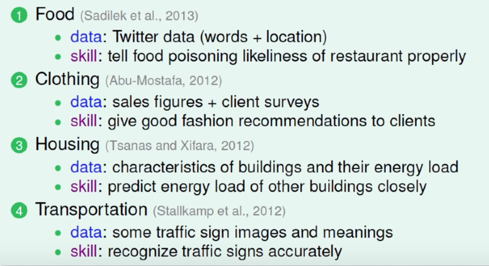
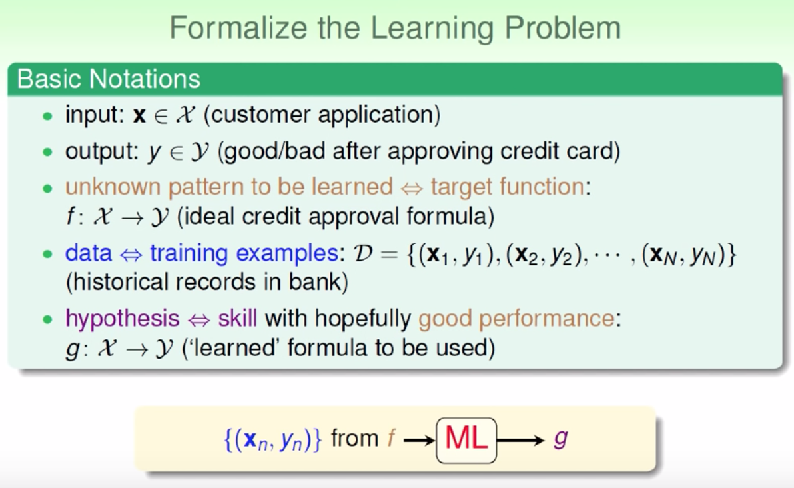
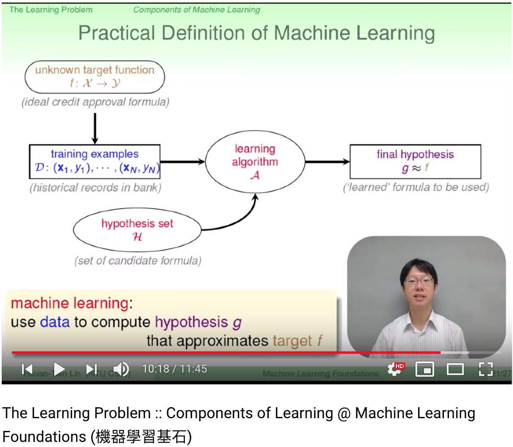

Youtube 線上課程：
講師 林軒田

- [Applications of Machine Learning](https://youtu.be/PveL3-fO_Qk)
- [Components of Learning](https://youtu.be/pR1xsocj_Pw)

## 應用

食 - 告訴使用者哪家餐廳比較衛生。

衣 - 怎麼穿搭更時尚

住 - 告訴設計師，設計的房子是否耗能

行 - 加強機器對交通號誌辨識的準確性

育 - 透過學生答題來了解學生程度

樂 - Netflix 推薦電影給使用者



> 問題/需求的行為模式是什麼？需要什麼樣的資料？如何定義特徵？最後讓機器學習？

## 學習的要件

- input: X
- output: Y
- 未知的演算函式 f: X -> Y
- 訓練資料 D = {(Xn, Yn)}
- 假說，由機器學習得到的最好  演算法 g: X -> Y; g 跟 f 越相近越好！



舉例：
預測股票漲跌。打開電視台可以看到不少  名嘴聲稱有最好的  預測方式可以知道那支股票會漲會跌，預測方式各家不一。所以這個例子用來  解釋機器學習要件我認為不錯。

```txt
input：某家股票
output: 漲/跌
某種真正的演算法（未知）f: 某家股票 -> 漲/跌
訓練資料：每小時該家股票漲跌結果
機器學習得到的假說集合(hypothesis set)，可看作為各家名嘴
假說(hypothesis): 由機器得出的最佳表現結果 g
```


